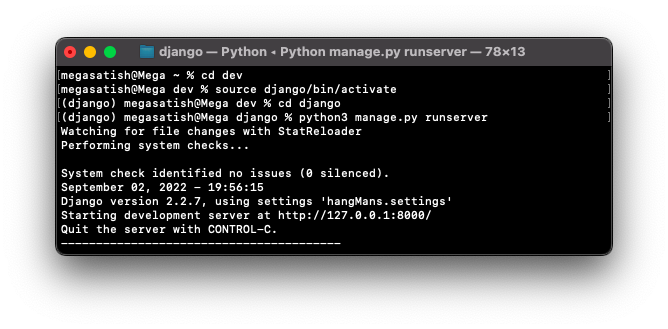
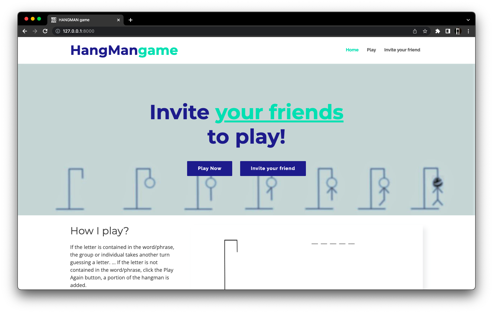
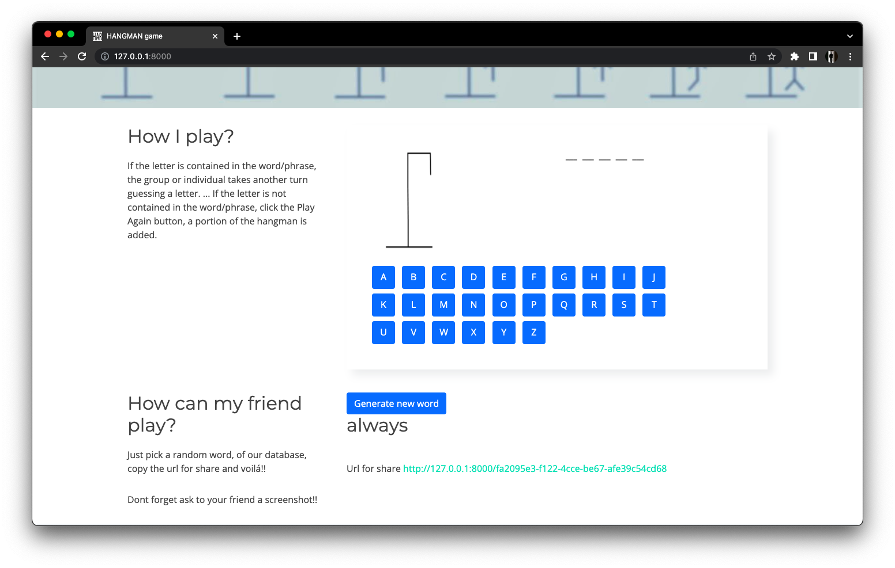
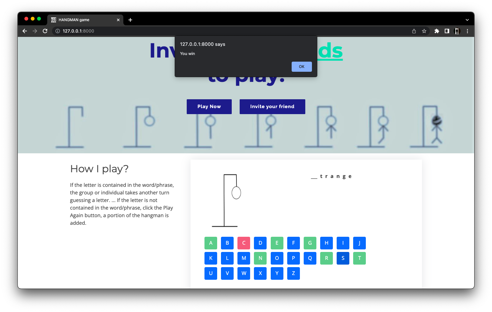

<div align="center">

  <a name="readme-top"></a>
  # Hangman Game in Django & Python

  [](LICENSE)
  
  [](https://github.com/Amey-Thakur/HANGMAN-GAME-IN-DJANGO-PYTHON)
  [](https://github.com/Amey-Thakur/HANGMAN-GAME-IN-DJANGO-PYTHON)

  A high-fidelity, interactive Hangman word game engineered with Django and Python. This system utilizes a robust RESTful state synchronization model to deliver a seamless, stateful gameplay experience across multiple lexical domains.

  **[Source Code](Source%20Code/)** &nbsp;·&nbsp; **[Technical Specification](docs/SPECIFICATION.md)** &nbsp;·&nbsp; **[Snapshots](#results)**

</div>

---

<div align="center">

  [Authors](#authors) &nbsp;·&nbsp; [Overview](#overview) &nbsp;·&nbsp; [Features](#features) &nbsp;·&nbsp; [Structure](#project-structure) &nbsp;·&nbsp; [Results](#results) &nbsp;·&nbsp; [Quick Start](#quick-start) &nbsp;·&nbsp; [Usage Guidelines](#usage-guidelines) &nbsp;·&nbsp; [License](#license) &nbsp;·&nbsp; [About](#about-this-repository) &nbsp;·&nbsp; [Acknowledgments](#acknowledgments)

</div>

---

<!-- AUTHORS -->
<div align="center">

  <a name="authors"></a>
  ## Authors

| <a href="https://github.com/Amey-Thakur"></a><br>[**Amey Thakur**](https://github.com/Amey-Thakur)<br><br>[](https://orcid.org/0000-0001-5644-1575) | <a href="https://github.com/msatmod"></a><br>[**Mega Satish**](https://github.com/msatmod)<br><br>[](https://orcid.org/0000-0002-1844-9557) |
| :---: | :---: |

</div>

> [!IMPORTANT]
> ### 🤝🏻 Special Acknowledgement
> *Special thanks to **[Mega Satish](https://github.com/msatmod)** for her meaningful contributions, guidance, and support that helped shape this work.*

---

<!-- OVERVIEW -->
<a name="overview"></a>
## Overview

**Hangman Game in Django & Python** is a full-stack interactive manifestation of the classic linguistic puzzle. By leveraging the **Django MVT (Model-View-Template) architecture**, this project provides a systematic exploration of server-side state persistence, asynchronous request handling (AJAX), and secure session orchestration.

The system is designed to provide a zero-latency interactive environment where the game logic is executed server-side, ensuring integrity while maintaining high responsiveness via client-side scripts.

### Core Heuristics
The interaction model is governed by strict **computational design patterns** ensuring fidelity and responsiveness:
*   **Lexical Randomization**: Implements complex randomization algorithms with stylized biases for project-specific branding (e.g., author names).
*   **Session-Based Persistence**: Utilizes the Django session framework to ensure game state isolation and persistence without requiring user authentication.
*   **Asynchronous Updates**: Integrated jQuery AJAX handlers for low-latency interactive updates, ensuring the board reflects player decisions without full-page reloads.

> [!TIP]
> **Stateful Operational Integrity**
>
> To maximize gameplay continuity, the system employs **Session-Level Persistence**. This ensures that the current word, fault count, and guessed letters are tracked uniquely per player, preventing state collision in multi-user environments while allowing for seamless game recovery.

---

<!-- FEATURES -->
<a name="features"></a>
## Features

| Feature | Description |
|---------|-------------|
| **Dynamic Lexicon** | Integrated **SQLite Word Bank** with randomized retrieval and high-fidelity hint mapping. |
| **AJAX State Sync** | Asynchronous **Visual State Updates** for real-time guessing and board orchestration. |
| **Shareable Challenges** | Unique **UUID Mapping** allows users to generate and share specific words with peers via encoded URLs. |
| **Anti-Inspection Security** | Hardware-level **JS Lockdown** to prevent unauthorized word peek via developer tools (anti-right-click/shortcut). |
| **Deterministic Result UI** | High-impact **Win/Loss Visuals** with automated game reset triggers and state-driven feedback. |
| **Scholarly Comments** | In-depth **Technical Documentation** integrated throughout the source for transparent logic study. |
| **Progress Persistence** | Robust **Session-Based Sync** ensuring mission data survives browser lifecycle events. |
| **Corporate Aesthetics** | High-performance **Reveal-based Architecture** optimized for professional and academic presentation. |

> [!NOTE]
> ### Advanced Security Diagnostics
> We have engineered a **Contextual Lockdown Layer** that disables standard developer interception methods (F12, right-click, etc.). This ensures the integrity of the lexical challenge, making the game truly tamper-proof for the average user.

### Tech Stack
- **Languages**: Python 3.10+, JavaScript (jQuery), HTML5, CSS3
- **Backend**: **Django 6.0.2** (Web Orchestration Engine)
- **Logic**: **State Persistence** (Django Sessions & ORM)
- **Database**: **SQLite** (Portable Archival Storage)
- **Security**: **Session Isolation** & **CSRF Middleware Integration**
- **Tooling**: Python Dotenv (Environment Orchestration)
- **UI System**: Modern Design (Custom CSS & Glassmorphism Aesthetics)

---

<!-- STRUCTURE -->
<a name="project-structure"></a>
## Project Structure

```python
HANGMAN-GAME-IN-DJANGO-PYTHON/
│
├── docs/                            # Project Documentation
│   └── SPECIFICATION.md             # Technical Architecture
│
├── Mega/                            # Attribution Assets
│   ├── Filly.jpg                    # Companion (Filly)
│   └── Mega.png                     # Profile Image (Mega Satish)
│
├── screenshots/                     # Visual Gallery
│   ├── homepage_1.png               # Main Interface
│   ├── homepage_2.png               # Active Gameplay
│   ├── terminal.png                 # Backend Logs
│   ├── winner.png                   # Victory State
│   └── loser.png                    # Game Over State
│
├── Source Code/                     # Primary Application Layer
│   ├── core/                        # Central Configuration
│   │   └── settings.py              # System Environment
│   ├── hangman/                     # Business Logic
│   │   ├── models.py                # Data Structures
│   │   └── views.py                 # Controller Layer
│   ├── static/                      # Frontend Assets (CSS/JS/Img)
│   ├── templates/                   # Render Components (HTML)
│   ├── db.sqlite3                   # Lexical Repository
│   ├── manage.py                    # Operations Utility
│   └── requirements.txt             # Dependency Manifest
│
├── SECURITY.md                      # Security Protocols
├── CITATION.cff                     # Project Citation Manifest
├── codemeta.json                    # Metadata Standard
├── LICENSE                          # MIT License
└── README.md                        # Project Entrance
```

---

<a name="results"></a>
## Results

<div align="center">
  <b>Terminal Interface: Backend Diagnostics</b>
  <br>
  <i>Live operational log showing request handling and lexical selection.</i>
  <br><br>
  
  <br><br><br>

  <b>Main Interface: Modern Design</b>
  <br>
  <i>Initial system state with optimized aesthetics and synchronized brand identity.</i>
  <br><br>
  
  <br><br><br>
 
  <b>Active Engagement: Logic Orchestration</b>
  <br>
  <i>Real-time interaction with the lexical word-bank via AJAX state sync.</i>
  <br><br>
  
  <br><br><br>

  <b>Victory State: Operational Success</b>
  <br>
  <i>System-wide win state triggered upon successful word deduction.</i>
  <br><br>
  
</div>

---

<!-- QUICK START -->
<a name="quick-start"></a>
## Quick Start

### 1. Prerequisites
- **Python 3.10+**: Required for Django 6 runtime. [Download Python](https://www.python.org/)
- **pip**: Python package installer.
- **Git**: For version control and cloning. [Download Git](https://git-scm.com/downloads)

> [!WARNING]
> **Environment Isolation Acquisition**
>
> It is highly recommended to utilize a **Virtual Environment (venv)** to prevent dependency collision with your global Python installation.

### 2. Installation & Setup

#### Step 1: Clone the Repository
Open your terminal and clone the repository:
```bash
git clone https://github.com/Amey-Thakur/HANGMAN-GAME-IN-DJANGO-PYTHON.git
cd HANGMAN-GAME-IN-DJANGO-PYTHON
```

#### Step 2: Navigate to Source
Access the primary application layer:
```bash
cd "Source Code"
```

#### Step 3: Install Core Dependencies
Synchronize the local environment with the mission requirements:
```bash
pip install -r requirements.txt
```

#### Step 4: Environment Configuration
Create a `.env` file in the `Source Code` directory:
```env
SECRET_KEY=your-secret-key-here
DEBUG=True
ALLOWED_HOSTS=*
```

### 3. Execution
Initialize the database and launch the Django development server:

```bash
python manage.py migrate
python manage.py runserver
```

---

<!-- USAGE GUIDELINES -->
<a name="usage-guidelines"></a>
## Usage Guidelines

This repository is openly shared to support learning and knowledge exchange across the engineering community.

**For Students**  
Use this project as reference material for understanding **Django MVT Architecture**, **Session-Based State Management**, and **Asynchronous AJAX Requests**. The source code is available for study to facilitate exploration of **Python-based web orchestration**.

**For Educators**  
This project may serve as a practical lab example or supplementary teaching resource for **Web Engineering** and **Python Development** courses. Attribution is appreciated when utilizing content.

**For Researchers**  
The documentation and architectural approach may provide insights into **systematic project structuring** and **stateful interactive loops in Django-based software**.

---

<!-- LICENSE -->
<a name="license"></a>
## License

This repository and all its creative and technical assets are made available under the **MIT License**. See the [LICENSE](LICENSE) file for complete terms.

> [!NOTE]
> **Summary**: You are free to share and adapt this content for any purpose, even commercially, as long as you provide appropriate attribution to the original authors.

Copyright © 2022 Amey Thakur & Mega Satish

---

<!-- ABOUT -->
<a name="about-this-repository"></a>
## About This Repository

**Created & Maintained by**: [Amey Thakur](https://github.com/Amey-Thakur) & [Mega Satish](https://github.com/msatmod)

This project features **Hangman Game**, a high-fidelity interactive lexical challenge system. It represents a personal exploration into **Django**-based backend orchestration and high-performance interactive design via **asynchronous state synchronization**.

**Connect:** [GitHub](https://github.com/Amey-Thakur) &nbsp;·&nbsp; [LinkedIn](https://www.linkedin.com/in/amey-thakur) &nbsp;·&nbsp; [ORCID](https://orcid.org/0000-0001-5644-1575)

### Acknowledgments

Grateful acknowledgment to [**Mega Satish**](https://github.com/msatmod) for her exceptional collaboration and partnership during the development of this Hangman Game project. Her constant support, technical clarity, and dedication to software quality were instrumental in achieving the system's functional objectives. Learning alongside her was a transformative experience; her thoughtful approach to problem-solving and steady encouragement turned complex requirements into meaningful learning moments. This work reflects the growth and insights gained from our side-by-side journey. Thank you, Mega, for everything you shared and taught along the way.

Special thanks to the **mentors and peers** whose encouragement, discussions, and support contributed meaningfully to this learning experience.

---

<div align="center">

  [↑ Back to Top](#readme-top)

  [Authors](#authors) &nbsp;·&nbsp; [Overview](#overview) &nbsp;·&nbsp; [Features](#features) &nbsp;·&nbsp; [Structure](#project-structure) &nbsp;·&nbsp; [Results](#results) &nbsp;·&nbsp; [Quick Start](#quick-start) &nbsp;·&nbsp; [Usage Guidelines](#usage-guidelines) &nbsp;·&nbsp; [License](#license) &nbsp;·&nbsp; [About](#about-this-repository) &nbsp;·&nbsp; [Acknowledgments](#acknowledgments)

  <br>

  🎮 **[Hangman Game in Django & Python](https://github.com/Amey-Thakur/HANGMAN-GAME-IN-DJANGO-PYTHON)**

  ---

  ### 🎓 [Computer Engineering Repository](https://github.com/Amey-Thakur/COMPUTER-ENGINEERING)

  **Computer Engineering (B.E.) - University of Mumbai**

  *Semester-wise curriculum, laboratories, projects, and academic notes.*

</div>
