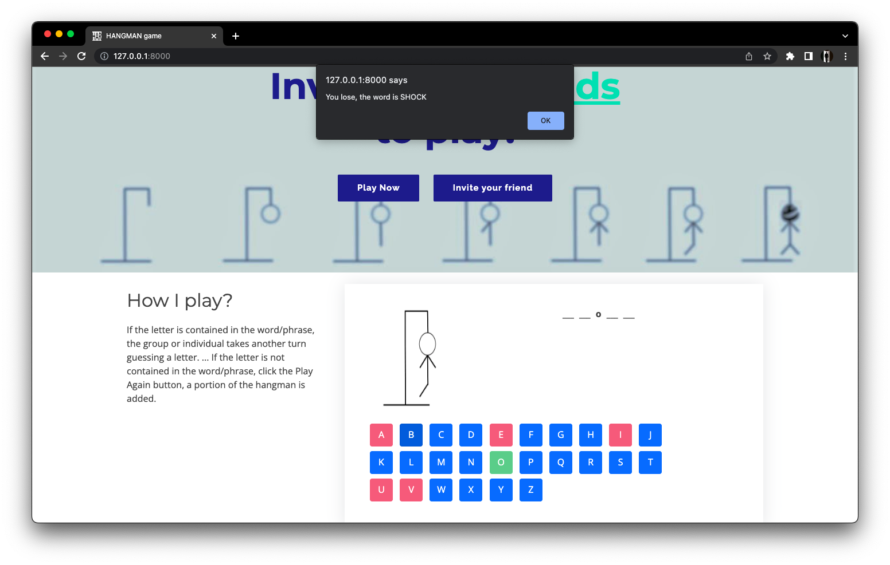

# HANGMAN-GAME-IN-DJANGO-PYTHON

>**Hangman Game Django Web App**

## **Steps to run django web application**

1. Create a virtual environment. 

2. Clone the repository in the virtual environment.

3. Activate the environment.

4. Run this command to install packages.
``` bash
pip install -r requirements.txt
```

5. Run the following command to start the server
``` bash
python manage.py runserver
```

---

# Snapshots of output

>**Terminal**


>**Homepage**


>**Winner**


>**Loser**



---

<p align="center"> <b> 👉🏻 Created to Learn Django 👈🏻 <b> </p>
 
<p align="center"> <b> 👷 Project Authors: Amey Thakur and Mega Satish <b> </p>
 
<p align="center"><a href='https://github.com/Amey-Thakur/COMPUTER-ENGINEERING', style='color: greenyellow;'> ✌🏻 Back To Engineering ✌🏻</p> 
