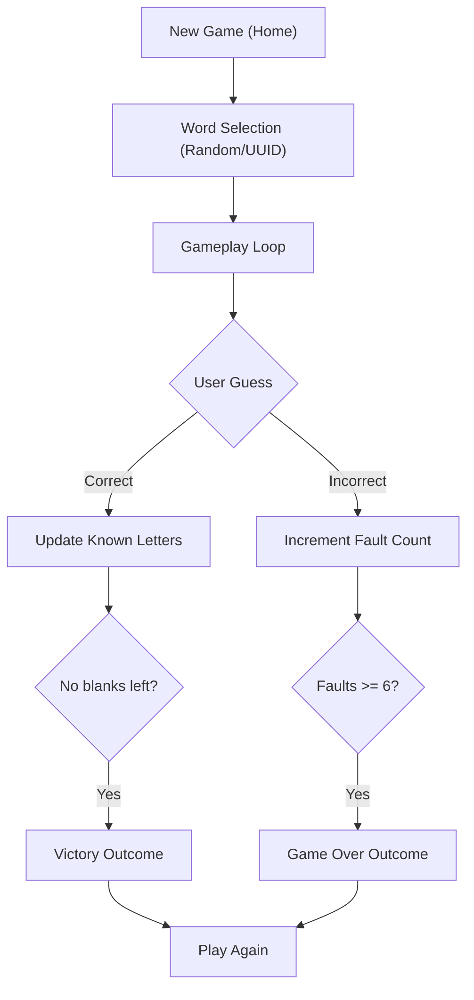

# Technical Specification: Hangman Game in Django & Python

## Architectural Overview

**Hangman Game in Django & Python** is a web-based implementation of the classic word-guessing game. The project utilizes a **Full-Stack Django Architecture** to provide a seamless, interactive, and educational gaming experience. It bridges **Server-Side Python Logic** with **Client-Side JavaScript (AJAX)** to manage game states, animations, and user interactions in real-time.

### Game Logic Flow

---

## Technical Implementations

### 1. Backend Core (Django)
-   **Web Framework**: Powered by **Django 3.x+**, managing routing, session-based state persistence, and template rendering.
-   **Data Storage**: Utilizes **Django Models** with an SQLite backend to manage `Word` banks and active `Game` sessions.
-   **RESTful AJAX Handlers**: Implements `JsonResponse` endpoints for asynchronous letter processing without page reloads.

### 3. Frontend Interface
-   **Dynamic Templating**: Uses **Django Template Language (DTL)** to inject dynamic game IDs and word data into the HTML structure.
-   **AJAX Integration**: Employs **jQuery AJAX** to send guesses to the server and update the UI (word blanks, hangman images, keyboard status) dynamically.
-   **Responsive Design**: Built with **Bootstrap** and custom **CSS3 animations** for a premium, cross-device compatible interface.

### 5. Game Logic Engine
-   **Session Management**: Strictly filters game states using **Django Session IDs** to prevent cross-session data leakage and ensure fair play.
-   **Fault Tracking**: Implements a 6-stage progressive hangman visualization linked directly to the application's internal state machine.
-   **Safe Word Handling**: Sanitizes inputs and manages words via a centralized word-bank for high reliability and extensibility.

---

## Technical Prerequisites

-   **Runtime**: Python 3.8 or higher ([Python.org](https://www.python.org/)).
-   **Web Framework**: Django 3.2+ (LTS recommended).
-   **Frontend**: jQuery 3.x, Bootstrap 4.x (CDN or Static).
-   **Environment**: Virtualenv or Conda with dependencies listed in `requirements.txt`.

---

*Technical Specification | Hangman Game | Version 8.0*
